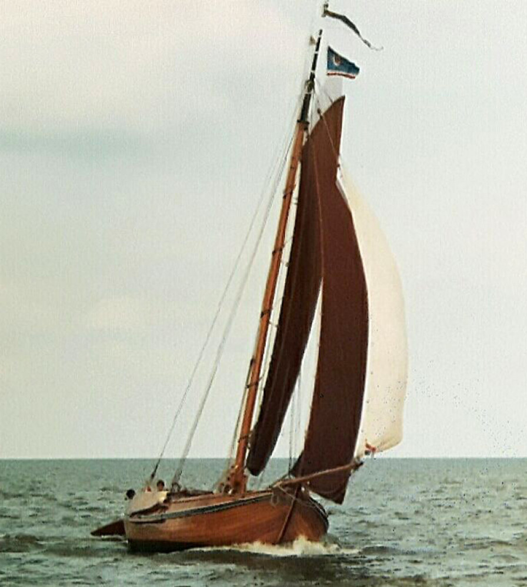

## De Bruiser

<figure id="foto_bruiser">
    
    <figcaption>Bruiser</figcaption>
</figure>

<aside class="note">
    Particulier bezit
</aside>

### Het Verhaal van de Bruiser

De botter 'Bruiser' is in 1917 gebouwd door Klaas de Haas in Monnickendam als Jachtbotter voor professor Rein Kuyper uit Amsterdam. De botter speelt een centrale rol in het boek "Zwervend langs het IJsselmeer" van zoon en schrijver Wim Kuyper. Met de 'Bruiser' maakte Wim de vele tochten op het IJsselmeer. De ervaringen en waarnemingen die hij daarbij (op)deed, staan als een historisch document, uitvoerig beschreven in zijn boek. Klaas de Haas deed in in Durgerdam, in de tijd van de fam. Kuyper ook het onderhoud aan de botter. Het schip is nog nagenoeg in originele staat. De huidige eigenaar vaart sinds 1978 met de botter.  

Het botterjacht Bruiser viert zijn eeuwfeest, en eigenaar Henk Hulst, medeoprichter van de botterstichting Elburg, heeft haar veertig jaar in bezit. Hij kocht het schip ooit omdat zijn vrouw niet op een "echte" botter uit de visserij wilde stappen - dat stonk teveel naar vis en teer. Na een rijk leven zet Hulst (76) de Bruiser nu in als motorjacht.
In het standaardwerk De Botter schrijft J. van Beylen dat jachtlui natuurlijk andere opvattingen over bouw en gebruik van hun schepen hadden dan vissers. Zo was er de voorkeur voor een kajuit. De Bruiser is wel volgens botter-maten gebouwd: 11,95 meter lang en 3,66 breed, maar met een kajuit.
De Bruiser werd in 1917 op stapel gezet door De Haas in Monnikendam voor prof. Rein Kuyper uit Amsterdam die haar in 1918 in de vaart nam. Het botterjacht behield altijd de oorspronkelijke naam, toen het eerst in 1934 aan Jonkman werd verkocht en in 1947 aan H. Rolman uit Soest. Na een paar jaar verkocht die het jacht aan de familie Doodeheefer die het in 1964 doorverkocht aan prof. dr. J.R. Blickman uit Groningen. Toen de Bruiser in 1978 bij Stofberg te koop stond kocht Hulst de botter. Het schip is ingeschreven bij de SSRP (Stichting Stamboek Rond- en Platbodemjachten) plaquette numIn het standaardwerk De Botter schrijft J. van Beylen dat jachtlui natuurlijk andere opvattingen over bouw en gebruik van hun schepen hadden dan vissers. Zo was er de voorkeur voor een kajuit. De Bruiser is wel volgens botter-maten gebouwd: 11,95 meter lang en 3,66 breed, maar met een kajuit. Nadat Henk Hulst mede de Elburger botterstichting had opgericht zocht hij een schip om samen met zijn vrouw te kunnen zeilen. Die had niets met botters. De EB24, de eerste botter van de stichting en rechtstreeks uit de visserij, stonk nog naar vis en teer in die tijd. Maar via een advertentie zag Hulst een botterjacht te koop liggen bij Stofberg. Hulst kreeg de botter te zien en was op slag verliefd, vooral op de teakhouten opbouw. 'Vroeger was die van grenen,' vertelt Hulst. De Bruiser werd in 1917 op stapel gezet door De Haas in Monnikendam voor prof. Rein Kuyper uit Amsterdam die haar in 1918 in de vaart nam. Het botterjacht behield altijd de oorspronkelijke naam, toen het eerst in 1934 aan Jonkman werd verkocht en in 1947 aan H. Rolman uit Soest. Na een paar jaar verkocht die het jacht aan de familie Doodeheefer die het in 1964 doorverkocht aan prof. dr. J.R. Blickman uit Groningen. Toen de Bruiser in 1978 bij Stofberg te koop stond kocht Hulst de botter. Het schip is ingeschreven bij de SSRP (Stichting Stamboek Rond- en Platbodemjachten) plaquette nummer 353 met zeilnummer VB2 en nagenoeg in originele staat en een gemeentelijk monument voor Elburg met nummer GM263. Wim Kuyper, de zoon van Rein, schreef een boek geïnspireerd door de zeiltochten in zijn jongere jaren. "Zwervend langs het IJsselmeer (1978)" geeft een mooi beeld van de overgang van Zuiderzee naar IJsselmeer.

1978: Herinneringen van Wim Kuyper in zijn boek "Zwervend langs het IJsselmeer"

In zijn boek "Zwervend langs het IJsselmeer" schrijft Wim Kuyper het volgende:
Het hellingen van de 'Bruiser' herinner ik mij nog goed; het schip werd in het verlengde van de langshelling van de Haas in Durgerdam gebracht en de slede precies in het midden onder het vlak van het schip geschoven. De mannen waren dan met een vlot en een 'bakkie' waarin meestal wat water stond, druk in de weer om de slee met touwen op haar plaats aan het schip vast te binden. Aan het einde van de helling stond de kaapstander waarmede de kabel van de slee-talie werd aangetrokken. Twee palen werden door de kaapstander gestoken en met behulp van een rondlopend, geblinddoekt paard werd de 'Bruiser' omhoog gedraaid. De paardeboer Kees Pauwels had altijd hetzelfde paard voor de werf beschikbaar; het was geen jonkie en ook geen draver. Het paard had het niet gemakkelijk wanneer zware schepen omhoog gedraaid moesten worden; de warme dampen stegen dan van zijn huid omhoog en soms moesten enkele mannen meehelpen

### De Gegevens van de Bruiser

| Gegeven                   | Waarde         |  
|---------------------------|----------------|   
| lengte 	                |  11,95 mtr     | 	 
| breedte 	                |   4,05 mtr     | 
| diepgang 	                |   0,9  mtr     | 		 
| kruiphoogte 	            |   1,8  mtr     | 	 
| tonnage 	                |    	         | 	
| materiaal romp 	        | hout 	         |  
| materiaal romp (spec.) 	| eikenhout      |  
| bouwwijze romp 	        | karveel        |  
| seriematige bouw 		    |                |  
| voortstuwing (oorspr.) 	| zeil           |   	 
| masthoogte 	            |    15  mtr     |
| soort tuig 	            | gaffelgetuigd  |  	 
| materiaal zeil 	        |    dacron      |   	 
| oppervlakte zeil 	        |  	 82 m2       |
| motortype 	            | universel benz.|  	 
| motorvermogen             |  	 45 pk       | 
| motorbouwjaar 		    | 1954           |  
| bouwjaar vaartuig 	    | 1917 	         |  
| bouwperiode 	            | 1910-1920	     |

Bron: [Federatie Varend Erfgoed Nederland](https://rven.info/schip.aspx?=1666)

