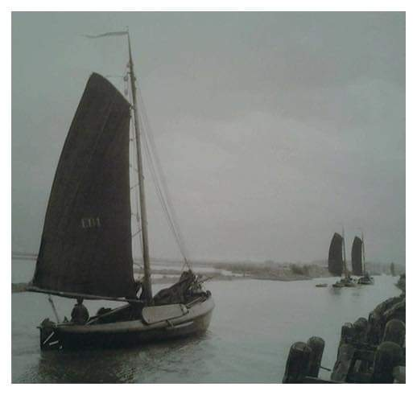

## De EB1 

<figure id="foto_eb1">
    
    <figcaption>EB 1</figcaption>
</figure>

### Het Verhaal van de EB1

In mei 1938 koopt Jan aan ‘t Goor de Marker botter MK 81 voor Fl. 210,- van de gebroeders Zeeman te Marken. 
Deze heren hadden deze botter in 1922 gekocht van Hendrik Stam te Ransdorp (RD 11).
De botter is in 1890 gebouwd, vermoedelijk op de werf van Kok in Huizen.
Van 1912 tot 1938 viste Jan aan ‘t Goor met een grote bons onder het nummer EB 1. Tot 1925 deed hij dat met 
vreemde knechten, maar vanaf die tijd kwam zoon Hannes aan boord en iets later ook zoon Hendrik de bemanning 
versterken. Hannes verlaat in 1938 de visserij, vader Jan en zoon Hendrik vissen dan nog samen tot 1950, 
Hendrik blijft vissen tot 1955 en stopt dan als visser.  
De aan ‘t Goors stonden bekend als zeer bekwame ‘hoekwantvissers’, deze visserijvorm was dan ook hun 
hoofdbestaansbron.  
In 1939 en 1941 werd de botter opgeknapt op de werf van Balk en in 1946 volgde een grote beurt op de werf van 
Van Goor in Monnickendam. Hierbij werden o.m. de huid, de berghouten en de stuiten vernieuwd, kosten Fl 9.000,-
Aanvankelijk werd door de firma Zoet een A-Ford motor ingebouwd, welke in 1951 werd vervangen door een 
4-cylinder Dodge.  
In februari 1957 wordt de EB 1 verkocht aan A. van den Belt te Oude Wetering (ZH). Deze gebruikte hem voor de 
pleziervaart, ze kreeg de naam ‘Almere’ en had een tijdje Kampen als thuishaven. In de jaren zestig vinden we 
de boot terug in Spakenburg. Ze is dan inmiddels voorzien van een roef. Nieuwboer koopt haar voor Fl. 2000,-, knapt 
haar wat op en voorziet haar van een nieuwe mast, d.w.z. de oude mast van de HK 127. Vervolgens wordt het schip 
voor Fl. 8000,- verkocht aan de toenmalige burgemeester van Bunschoten.
In 1967 wordt het schip eigendom van P. Brantjes, tandarts te Barneveld. Ze krijgt de naam ‘Willem Eggerts’, 
naar de in 1885 gebouwde 1.353 ton wegende driemastbark, het eerste ijzeren zeilschip van de Nederlandse vloot.
Via Nieuwboer wordt het in 1972 voor FL. 16.000,- verkocht aan de Duitsers Hartmann Smit en Willy Schlenker. 
Zij laten het schip opknappen en voorzien van een ijzeren plecht. Vervolgens wordt het verkocht aan een drietal 
Duitsers, waarvan Eckhart Ritmansperger de uiteindelijke eigenaar wordt. Het toezicht en beheer is in handen van Aart van Diermen te Spakenburg.
In 1992 verkoopt Ritmansperger het schip voor Fl. 15.000,- aan de Stichting tot Behoud van de Elburger Botters 
en wordt daarmee het derde schip van de vloot.  
Bij Nieuwboer wordt het schip opgeknapt en weer in oude staat teruggebracht. Eind 1993 komt het schip weer 
als EB 1 terug in de Elburger haven. In de winter van 1998/’99 wordt het schip gedeeltelijk gerestaureerd 
op de werf van Nieuwboer te Spakenburg; ze is er dan hard aan toe. Onder meer wordt het vlak vernieuwd, 
komen er aan bakboord nieuwe spanten en huidplanken. Een volgende winter zal de restauratie worden hervat.
Ook werd de Mercedes-diesel vervangen door een Samofa en werd er weer een ouderwetse keerkoppeling met een 
grote hendel geplaatst.  

*‘Hier scheen ons ‘t water ‘t overstromen*  
*en werden wij gedreigd door ‘t vuur*  
*maar Gij deed ons ‘t gevaar ontkomen*  
*verkwikkend ons ter goeder uur’*    

Dit is de tekst die het deurtje siert, naar een citaat uit Psalm 66. Deze tekst sprak de oude Jaap Westerink 
uit toen de aan “t Goors in 1938 terugkwamen van een reis waarop een blik benzine in het vooronder in brand 
vloog en men, wonder boven wonder, zonder noemenswaardige schade aan het vuur ontsnapte.

### De Gegevens van de EB1

| Gegeven                   | Waarde        |  
|---------------------------|---------------|   
| lengte                    | 13,55  mtr    |  
| breedte                   |  4,1   mtr    |  
| diepgang 	                |  1,0   mtr    |  	 
| kruiphoogte 	            |  2,0   mtr    |  	 
| tonnage 		            |               |   
| materiaal romp 	        | hout          |   	 
| materiaal romp (spec.)    | eiken 	    |   
| bouwwijze romp 	        | karveel       |   
| seriematige bouw          |               |   		 
| voortstuwing (oorspr.) 	| zeil          |  	 
| masthoogte 	            | 14,5   mtr    |   
| soort tuig 	            | gaffeltuig    |  
| materiaal zeil 	        | katoen        |  
| oppervlakte zeil 	        | 80 	  m2    |  
| motortype 	            | Samofa        |  
| motorvermogen 	        | 30      pk    |  	 
| motorbouwjaar 	        | 1962 	        |  
| bouwjaar vaartuig 	    | 1885 	        |    
| bouwperiode 	            | 1880-1890     |  

Bron: [Federatie Varend Erfgoed Nederland](https://rven.info/schip.aspx?=1181)
s

