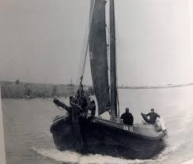

## EB 15

<figure id="foto_eb15">
    
    <figcaption>EB 15</figcaption>
</figure>

### Het verhaal

Het verhaal van de EB 15 is bijzonder. Het schip was vanaf 1922 eigendom van Peter van der Heide, een bekende 
naam voor heel vissend Elburg. Ook oud-voorzitter van de Stichting tot Behoud van de Elburgse Botters, 
Henk Hulst, heeft op de botter gevaren. 'Vanaf mijn tiende mocht ik in de vakantie mee de zee op, op dit schip.'
Het is duidellijk dat hij veel herinneringen op het schip heeft liggen. 'Om met Peter "Lurkien” 
(de bijnaam van Peter van der Heide)  uit te varen te gaan, was een hele ervaring. Ik vind het geweldig dat 
we het schip nu in oude glorie gaan herstellen.'
Van der Heide verkocht zijn schip niet lang na de afsluiting van de Zuiderzee. In 1958 nam de 
familie Van de Broek uit Baarn het schip over, waarna het lange tijd uit het zicht van de Elburgers verdween. 
'Totdat we er op de een of andere manier achter kwamen dat het in de provincie Groningen lag', memoreert 
Henk Walles, huidig voorzitter van de Botterstichting. 'Daar hebben we op dat moment niets mee gedaan, want 
wij konden er niet nog een wrak bij hebben op dat moment.' Een andere Elburger echter wel. 'Henk Schreurs 
heeft toen de EB 15 gekocht. Hij is er nog mee vanuit Delfzijl naar Elburg gevaren, maar het was wel duidelijk 
een wrak.' Schreurs had zichzef tot doel gesteld het schip volledig te herstellen. 'Daar is hij ook bijzonder 
enthousiast mee aan de slag gegaan. Het is echt aan Henk te danken dat het schip er nog is.'  
Helaas liet zijn gezondheid Schreurs in de steek. 'Hij wilde heel graag de EB 15 zelf restaureren, maar het 
werd al snel duidelijk dat dat niet ging lukken', weet Walles. 'Daarom heeft hij het schip aan ons geschonken.'
Inmiddels kan de Botterstichting dit nieuwe project er wel bij hebben. ‘We hebben de afgelopen jaren de EB 29 
gerestaureerd. De ervaring daarvan neem ik mee in dit project', legt Leusink uit. De loods op de werf is 
daarom vrij voor de restauratie van de EB 15.
Bij een eerdere reddingspoging is het schip ingepakt in ijzer. 'Als dat niet was gebeurd, was het al ingestort',
zo schat Leusink in. 'In de tijd dat de EB 15 op de wal heeft gestaan, is er al twee keer brand aan boord 
geweest, dus is het schip alleen maar verder afgetakeld. De ijzeren 'jas' van de EB 15 kan Leusink goed 
gebruiken voor de maatvoering van het schip. 'Maar we gaan natuurlijk weer een houten schip bouwen.'

    De moeder van Margrieta Kroese, Eib was een dochter van Peter v/der Heide en werkte toendertijd  
    bij mijn ouders,dus de link met de 15 was gauw gelegd.  
    Ik mocht toen 4 á 5 keer s'nachts mee, een hele belevenis voor een jong van 10/11  
    jaar, veel zeeziek dat weet ik nog wel.
    Maar een onuitwisbare herinnering dat was et!

     

    Ook weet ik nog dat 's morgens om 8 uur de bel ging en "ome Peter" op de stoep stond   
    om eem wasmachientje te kopen, had ie in 1 nacht verdiend door met storm weer   
    binnen de "Lijn" dus verboden gebied, te vissen.  
    Hij was die nacht alleen op zee,de hele vloot lag vanwege de storm binnen.

### Gegevens

| Gegeven                   | Waarde        | Eenheid   |
|---------------------------|---------------|-----------| 
| lengte 	                | 12            | mtr       | 	 
| breedte 	                | 4,3           | mtr       | 		        
| diepgang 	                | 0,8           | mtr       | 		 
| kruiphoogte 	            | 2,5 	        | mtr       | 	 
| tonnage 	                | 15 	        | mtr       | 	
| materiaal romp 	        | hout 	        |           |
| materiaal romp (spec.) 	| eikenhout     |           |
| bouwwijze romp 	        | karveel 	    |           |
| seriematige bouw 		    |               |           |
| voortstuwing (oorspr.) 	| zeil          |           | 	 
| masthoogte 	            | 3,5 	        | mtr       |
| soort tuig 	            | gaffelgetuigd |           |	 
| materiaal zeil 	        | katoen        |           | 	 
| oppervlakte zeil 	        | 80 	        | m2        |
| motortype 	            | niet aanwezig |           |	 
| motorvermogen             |    		    |           | 
| motorbouwjaar 		    |               |           |
| bouwjaar vaartuig 	    | 1904 	        |           |
| bouwperiode 	            | 1900-1910 	|           | 

[Federatie Varend Erfgoed Nederland](https://rven.info/schip.aspx?=2937)