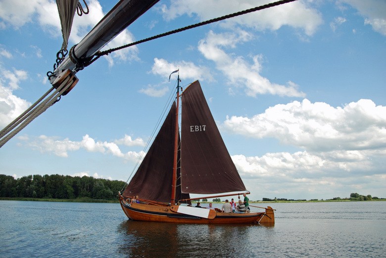

## De EB17

<figure id="foto_eb17">
    
    <figcaption>EB 17</figcaption>
</figure>

### Het Verhaal van de EB17

De EB 17 Is gebouwd in 1918 in opdracht van Hannes aan ’t Goor. Aan ’t Goor was op dat moment al in het bezit 
van de EB 27, maar aangezien de familie drie zonen had werd een tweede botter aangekocht. De werf De Haas te 
Durgendam bouwde de botter voor F 3.700,-. De botter werd contant afgerekend, want de familie had de 
voorafgaande jaren goed verdiend aan het vervoer van arbeiders die van en naar Amsterdam vervoerd moesten 
worden om de havenarbeiders te vervangen die kort na de eerste wereldoorlog staakten.    
  
Aan ’t Goor viste vanaf 1922 met zijn zoon Gerrit op de EB 17. Hannes en Jan visten op de EB 27. Met de twee 
botters werd hoofdzakelijk met het hoekwant gevist. Met de drijfnetten vormden de twee botters een span.
De EB 17 werd al voor 1930 voorzien van een hulpmotor. Voor Fl. 85 werd er een T-Ford motor ingebouwd. 
Daarmee was de botter een van de eerste schepen van de Elburger vloot die een hulpmotor had. Later is de 
T-Ford vervangen door een A-Ford.   
  
Toen in 1937 ook de jongste zoon Henk aan boord kwam, visten de aan ’t Goors vrijwel alleen nog met het hoekwant.
De beug bestond uit twaalf spleten van 200 haken per dag. In 1948 is er een eerste grote renovatie op de EB 17 
uitgevoerd op de werf van Balk in Elburg. Voor totaal 6110 gulden werd de botter weer helemaal opgeknapt.  
In 1955 beëindigden de gebroeders aan ’t Goor de visserij in verband met de inpoldering van Oostelijk-Flevoland. 
De botter werd in 1957 verkocht aan de heer Boonstra uit Leeuwarden om als pleziervaartuig verder te gaan.
De botter kreeg de naam Séhoun en had Koudum als thuishaven. Na verloop van tijd kwam de boot stil te liggen en 
raakte steeds verder in verval.  
Jan Willem Stofberg kocht in 1987 de totaal vervallen botter op en bracht haar naar Enkhuizen. De zeven 
daaropvolgende jaren werd vrije tijd opgeofferd om er weer een mooie schuit van te maken. Op 28 mei 1994 werd 
de geheel gerestaureerde botter EB 17 feestelijk te water gelaten.
In 1999 verwisselde de botter van eigenaar en ging Theo Kuipers uit Wijdenes met de botter varen. Totdat in 
2006 Sjouke Berga uit Elburg de boot weer terug bracht naar haar oorspronkelijke haven. In 2010 vertrok Berga 
uit het land en verkocht de EB 17 aan de [Stichting tot Behoud van Elburger Botters](https://www.botterselburg.nl).

Bron: [Website Botterstichting Elburg](https://botterselburg.nl/pagina_output.php?id=21)

Jan Willem Stofberg verkreeg de botter voor 1 ouwerwetse gulden...  
Wim Hoeve schoot het geld voor en kreeg het jaren later volledig van de club terugbetaald...

### De Gegevens van de EB17

| Gegeven                   | Waarde        |  
|---------------------------|---------------|   
| lengte 	                | 11,8    mtr   | 	 
| breedte 	                | 3,7     mtr   | 		        
| diepgang 	                | 0,9     mtr   | 		 
| kruiphoogte 	            | 12,45   mtr   | 	 
| tonnage 	                |    	        | 	
| materiaal romp 	        | hout 	        |  
| materiaal romp (spec.) 	| eikenhout     |  
| bouwwijze romp 	        | karveel 	    |  
| seriematige bouw 		    |               |  
| voortstuwing (oorspr.) 	| zeil          |   	 
| masthoogte 	            | 12,45   mtr   |  
| soort tuig 	            | gaffelgetuigd |  	 
| materiaal zeil 	        | katoen        |   	 
| oppervlakte zeil 	        | 83,04	  m2    |  
| motortype 	            | Perkins       |    	 
| motorvermogen             | 65   	  pk    |  
| motorbouwjaar 		    | 1992          |  
| bouwjaar vaartuig 	    | 1918 	        |  
| bouwperiode 	            | 1910-1920 	|   

Bron: [Federatie Varend Erfgoed Nederland](https://rven.info/schip.aspx?=1753)

