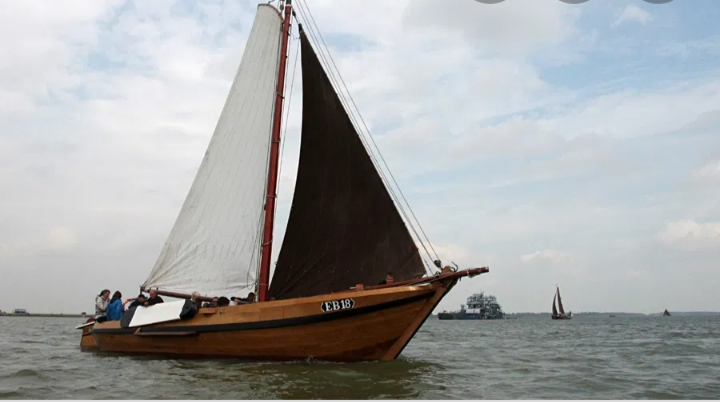

## De EB18 (Botter)

<figure id="foto_eb18b">
    
    <figcaption>EB 18 (Botter)</figcaption>
</figure>

### Het Verhaal van de EB18 (Botter)

**Geschiedenis**

De EB 18 is gebouwd in 1893 en heeft tot 1959 deel uitgemaakt van de vissersvloot van Harderwijk en Elburg. Het schip werd gebruikt om te vissen op haring, spiering, paling en bot.
Uiteindelijk dreigde de boter op de Purmerringvaart haar laatste rustplaats te krijgen, in 1981 is het schip weer gelicht en opnieuw in de vaart gebracht.
Onder leiding van ervaren bemanning kunt u een zeiltocht maken met de EB18, voor een fantastische ervaring .Door de botter te huren draagt u een steentje bij aan de instandhouding van dit varende monument

Heb je meer over de historie, vul het aan!

### De Gegevens van de EB18 (Botter)

| Gegeven                   | Waarde        |  
|---------------------------|---------------|   
| lengte                    | 11,65  mtr    |  
| breedte                   |  4     mtr    |  
| diepgang 	             |  0,65  mtr    |  	 
| kruiphoogte 	             |  1,1   mtr    |  	 
| tonnage 		        |               |   
| materiaal romp 	        | hout          |   	 
| materiaal romp (spec.)    | eiken 	    |   
| bouwwijze romp 	        |               |   
| seriematige bouw          |               |   		 
| voortstuwing (oorspr.)    | zeil          |  	 
| masthoogte 	             | 13,85  mtr    |   
| soort tuig 	             | gaffeltuig    |  
| materiaal zeil 	        | katoen        |  
| oppervlakte zeil 	        | 55 	  m2     |  
| motortype 	             | Beta Marine   |  
| motorvermogen 	        | 65      pk    |  	 
| motorbouwjaar 	        | 1997 	    |  
| bouwjaar vaartuig 	   | 1890 	    |    
| bouwperiode 	             | 1890-1900     |  

Bron: [Federatie Varend Erfgoed Nederland](https://rven.info/schip.aspx?=191)

