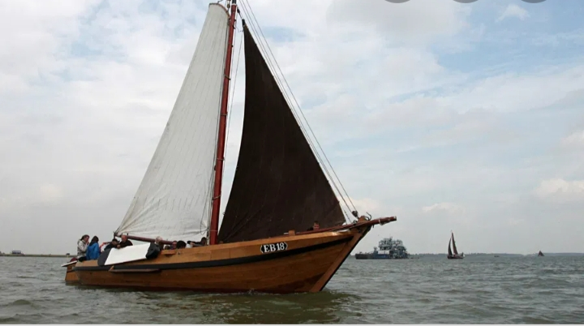

## De EB18 (Pluut)

*Geen Botter maar een Pluut*

<figure id="foto_eb18p">
    
    <figcaption>EB 18 (Pluut)</figcaption>
</figure>

<aside class="note">
    Particulieer bezit
</aside>

### Het Verhaal van de EB18 (Pluut)

**Eerdere Eigenaren van de Pluut:**

In januari 1913 kocht de Elburger Goosen van Ommen de Pluut in Hardewijk. De Pluut was in 1895 gebouwd en kreeg het harderwijkse nummer HK15. Van Gerrit Jacob Brands. Hij stopte met vissen en emigreerde.
De Pluut is gebouwd op de werf van Kuykhoven in Hardewijk. Dit was de eerste nieuwe schuit door hem gebouwd.
De Pluut kreeg in Elburg het vacante nummer EB18 (voorheen de botter EB18) deze was verkocht aan een harderwijkse visser. Later in 1954 terug gekocht door Gerard van de Heide (botje) deze was de laatste vissende eigenaar van de pluut.
Goossen van Ommen viste voornamelijk met zi-netten vanwege de slechte resultaten in de visserij verkocht hij de pluut in 1922 aan Coenraad Westerink (de Stootdolle) Coenraad Westerink viste 6 jaar met de Pluut.
In verband met plannen tot afsluiting en droogmaken van de Zuiderzee trok Coenraad Westerink in november 1928 naar Eindhoven om daar een viswinkel te beginnen.
Op 7 december 1929 werd de pluut via openbare verkoop. Onderleiding van notaris Hoefhamer verkocht. Het vaartuig ging met inbegrip van netten, zeilen en inventaris voor slecht fl. 234.10 naar de Gebr. Gerrit en Gerard van de Heide. De Gebr. Van de Heide verbraken de samenwerking in 1934, waarna Gerard van de Heide verder viste met de Pluut.

**Bijzondere Vangst….**
Gerard van de Heide viste aanvankelijk verder met zijn vader. En vanaf 1937 met zijn 14 jarige zoon Gerard.
Als bijzondere vangst kan gemeld worden dat de gebr. van de Heide in juni 1932een steur in de kuil vingen. Deze woog 158 pond en had een lengte van bijna 2 meter.
Motoren in de Pluut….
De Pluut was aanvankelijke voorzien van een 15 pk T-Ford motor. Later is deze vervangen door een Ballot-motor. Van der Heide had deze motor gekocht van Andries Heefhamer. Vandaag de dag is de Pluut voorzien van een Mitsubishi motor. Deze motor is door de Botterstichting onlangs in de boot gebouwd. En heeft nu ongeveer 100 draai uren gemaakt.
Gerard van de Heide Bekeurd….
Begin september 1937 werd Gerard van de Heide bekeurd wegens vissen in verboden gebied. Als straf werd zijn vergunning ingenomen en mocht hij 14 dagen niet vissen. Van de Heide ging toen voor 15 gulden per vracht kool varen naar Broekhaven voor respectievelijk J. Hoeve en L. Kruithof.
Restauraties aan de Pluut….
Eind september 1942 onderging de Pluut een grote timmerbeurt. Op de werf van Balk.
Deze reparatie koste toendertijd totaal: Fl 1612,-
Vanaf 21 oktober 1950 lag de EB 18 opnieuw op de helling van balk. Dit keer werd er voor fl 1982,50 aan de pluut vertimmerd. Op 11 januari 1951 werd de pluut weer te water gelaten.

**Zware Schade….**    
In september 1954 liep de EB 18 zware averij op. Tijdens een hevige storm werd de Pluut door een windhoos gegrepen en sloeg om Gerard van de Heide en zijn zoon Wim wisten zich te redden door zich aan de omgeslagen Pluut vast te houden. Ongeveer een kwartier na het ongeval ontdekte Hannes aan ’t Goor(EB36) de EB 18. een uitgevaren sleepboor probeerde de Pluut naar Elburg te brengen. Op ongeveer 8 km van Elburg brak echter een sluiting van de kabel waardoor de voorsteven van de Pluut zwaar beschadigd raakte. Enkele weken na het ongeval hebben enkele Elburger vissers de Pluut van, van der Heide in de Elburgse haven gesleept. Daan Balk heeft de pluut van Botje in maart 1955 gekocht en vervolgens opgetimmerd en omgebouwd tot jacht kort daarna heeft Balk het vaartuig verkocht.

**Laatst bekende informatie over de Pluut….**
Een aantal jaren gelden heeft de Stichting tot Behoud van de Elburger Botters de Pluut gekocht van Schildersbedrijf Lansink uit Almere.
De kajuit is inmiddels verwijderd en om zo het schip weer in z`n originele staat terug te brengen.
Door het grote aantal schepen van de stichting en gebrek aan vrijwilligers om alle schepen te onderhouden werd er gezocht naar particulieren die de historische vloot van Elburg een warm hart toe dragen.

**Aankoop geschiedenis….**
Zo verscheen in de Stentor het artikel ronde de EB 18 en werd hij aangeboden als “desnoods gratis af te halen” Na dit artikel hebben wij gereageerd en zijn er een jaar mee bezig geweest om de Pluut in handen te krijgen. Na een drietal gespreken en een goed plan zijn we in juni 2005 eigenaar geworden van de Pluut.

**Momenteel verrichte arbeid….**
Inmiddels is er al veel gebeurd. Ten eerste heeft hij 14 dagen op het droge gelegen om lekkage te verhelpen. Tevens is de onderkant opnieuw geschilderd. Na de te waterlating is de Pluut al verschillende malen ingezet voor verhuur.
In september 2005, tijdens het botterweekend heeft de pluut het gehele weekend meegedraaid. Van het vervoeren van een vracht kool tot meedoen aan de bedrijvenwedstrijd en de verhuurtjes op zaterdag.
In de wintermaanden zijn we bezig met een aantal zaken zoals nieuwe dekzeilen voor de zeilen, een trap om makkelijker van het vooronder te komen, een aansluiting voor zowel 220V als 12V en schilderwerk. Tevens krijgt de motor het nodige onderhoud.

**Oprichting Stichting Pluut EB18….**
Op 24 januari 2005 hebben we de pluut ondergebracht in de “stichting Pluut EB18 deze stichting heeft als doel: Restauratie van de Pluut in het belang van de historie van de oude vissers haven Elburg.
De Pluut blijft als thuishaven Elburg houden. Voor de komende jaren staat een grondige restauratie op stapel, waarvoor inmiddels al 3 offertes binnen zijn gekomen.

**Grondige restauratie 2012**
In 2012 en 2013 is de pluut een grondige restauratie ondergaan waarbij bijna alles compleet vernieuwd is. Dit werd gedaan in Elburg door het leer-werkproject van de Stichting tot behoud van de Elburger Botters in Elburg. In een jaar tijd is er keihard gewerkt om de pluut weer als nieuw te maken. Sinds de tewaterlating in 2013 steelt de pluut weer de show in de haven van Elburg! Door de restauratie kan de pluut er weer heel lang tegen aan waardoor er hopelijk nog veel mensen plezier van kunnen hebben!

Bron: [Website Stichting Pluut EB18](http://pluuteb18.nl/historie/)

### De Gegevens van de EB18 (Pluut)

| Gegeven                   | Waarde        |  
|---------------------------|---------------|   
| lengte 	                | 11,6    mtr   | 	 
| breedte 	                | 3,5     mtr   | 		        
| diepgang 	                | 0,6     mtr   | 		 
| kruiphoogte 	            | 2,45	  mtr   | 	 
| tonnage 	                |    	        | 	
| materiaal romp 	        | hout 	        |  
| materiaal romp (spec.) 	| eikenhout     |  
| bouwwijze romp 	        | overnaads     |  
| seriematige bouw 		    |               |   
| voortstuwing (oorspr.) 	| zeil          |    	 
| masthoogte 	            | 10      mtr   |
| soort tuig 	            | gaffelgetuigd |  	 
| materiaal zeil 	        | katoen        |   	 
| oppervlakte zeil 	        | 75 	  m2    |
| motortype 	            | Mitsubishi    |  	 
| motorvermogen             | 46 	  pk    | 
| motorbouwjaar 		    | 2003          |  
| bouwjaar vaartuig 	    | 1895 	        |  
| bouwperiode 	            | 1890-1900 	|   

Bron: [Federatie Varend Erfgoed Nederland](https://rven.info/schip.aspx?=2496)

