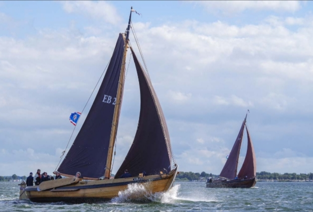

## De EB24

*Ons vlaggenschip waar het allemaal mee begon!*

<figure id="foto_eb24">
    
    <figcaption>EB 24</figcaption>
</figure>

### Het Verhaal van de EB24

De botter EB 24 werd in 1916 gebouwd op de werf van Oost in Harderwijk in opdracht van Aart Jansen (Aart van 
klein Jantje) uit Elburg, voor de prijs van F 1800,-. De zeilen werden gemaakt door zeilmaker Groen, eveneens 
te Harderwijk.  
Tot 1932 werd de schuit alleen zeilend gebruikt, maar in dat jaar werd er een T-Ford motor ingebouwd, de motor 
kostte Fl. 300,- en de schroefas en fundatie kostten Fl.  100,-.
Deze motor werd in 1946 vervangen door een A-Ford, die op zijn beurt in 1961 werd vervangen door een 
tweecilinder Samofa 2S-108, die 20 pk leverde bij 1.000 omwentelingen per minuut. Deze motor is weliswaar 
enige keren gerestaureerd maar doet tot op heden nog steeds dienst.
In tegenstelling tot wat de naam zou doen vermoeden, is de Samofa een oer-Hollands product, Samofa staat voor 
Samenwerkende Motoren Fabrieken te Harderwijk. Deze fabriek werd na de oorlog gesticht door de grote 
motorenfabrikanten Brons, Bolnes, Industrie en Kromhout om kleine scheepsmotoren te maken van 10 tot 30 pk.
Samofa werd in 1988 overgenomen door Mitsubishi.
De EB 24 is diverse keren gerestaureerd op de scheepswerf van Balk en kreeg drie keer een nieuwe plecht, 
de boeisels werden vervangen en ook kreeg het achterschip een opknapbeurt.
In 1965 haalden de gebroeders Jansen, die inmiddels hun vader hadden opgevolgd, de mast van de schuit om zo 
gemakkelijker onder de brug door te kunnen. Zo werd de EB 24 een motorbotter, wat ze bleef tot 1974 toen de 
gebroeders een stalen kotter kochten.
De oude botter werd gekocht door de vier oprichters van de Stichting tot Behoud van Elburger Botter.
Al gauw bleek dat eigenlijk een volledige restauratie noodzakelijk was. Eerst werd de trog vernieuwd, toen 
kwamen er nieuwe zwaarden en de originele mast kwam terug van het Zuiderzeemuseum, waaraan deze destijds door 
de gebroeders Jansen was geschonken.
De volledige restauratie werd gedaan door Rien Lipke in samenwerking met een aantal vrijwilligers in de winter
van 1979 en het voorjaar van 1980 en kostte in totaal Fl. 81.800,-.
Op 18 september 1980 werd de botter door H.K.H. Prinses Margriet feestelijk te water gelaten.
Inmiddels heeft de EB 24, bemand door vrijwilligers van de stichting, honderden passagiers vervoerd op korte 
en langere tochten, deed zij mee aan wedstrijden en demonstraties en maakte dus ook haar opwachting  bij een 
zeilevenement in Berlijn!
In de winter 1997/98 kreeg zij bij de werf van Nieuwboer in Spakenburg o.m. een nieuw zeilwerk en in de winter 
van 1998/99 werd op de eigen werf aan de Oude Bleeksweg door een aantal vrijwilligers het verdere onderhouds- 
en restauratiewerk verricht.
In het voorjaar van 1999 gaf, op weg naar Spakenburg, de motor op spectalulaire wijze de geest. Er was al 
geconstateerd dat de schuit in het achterschip erg lekte, maar op deze reis kwam ook de motorbak vol water te 
staan, kwam het vliegwiel in het water en ontstond er een zogenaamde ‘waterslag’, waardoor de krukas volledig 
in tweeën brak!
Gelukkig beschikten we over een reservemotor, ook een Samofa, en deze kon redelijk snel worden ingebouwd, zodat
de botter het hele seizoen verder weer operationeel was.
Wegens de eerder genoemde lekkage moest de botter toch weer de loods in; het achterste bunschot was volledig 
verrot. Met behulp van de vrijwilligers werd eerst de motor verwijderd, vervolgens de deken gelicht en het 
slechte schot gesloopt. Toen kwamen de Spakenburgers het nieuwe schot plaatsen en daarna kon alles weer 
opgebouwd worden en omdat hij toch binnen lag, werd hij meteen maar gelakt en geschilderd. Klaar voor het 
vaarseizoen 2000.
De laatste restauratie heeft in 2016/2017 plaatsgevonden. Omdat de hele geschiedenis van de Botterstichting 
met de EB 24 begon, is zij het vlaggenschip van de stichting.

In 1975 was de eerste Sail,omdat de mast er nog niet opstond mochten we niet deelnemen aan het evenement. We hebben toen een uitzondering weten te bewerkstelligen,namelijk: de "werkschip" functie, de zwaarden werden door Tolman uit Monnikendam gemaakt, dus 2 vliegen in een klap.  
De tocht er naar toe werd samen met de boeier de "Njord" van de fam.Offringa aan elkaar geknoopt gemaakt.
Wegbrengers waren Gart v/der Heide(de vader van Peter) Andries Hoefhamer,Jacob Hulst,Visscher broer v/de olde Koake en de oprichters,onderweg werd nog een grote drijvende licht opstand overvaren,maar omdat de 24 onderwater in het ijzer zat onstond er tot onze grote verbazing geen schipbreuk.
De mast hebben we uit het museum in Ketelhaven teruggehaald onder voorwaarde dat hij weer op de 24 gezet zou worden,uiteraard.
Gerald de Weerd was toen directeur daar, later is hij bekend geworden door de bouw van de replica van het schip waarmee Willem Barends naar Nova Zembla is gezeild en daar verongelukt.
Wat de Samofa betreft,nog steeds grote dank verschuldigd aan Wim van Rheenen die indertijd samen met Niko Verwij veel werk heeft verricht om ze aan de praat te houden,we hadden toen nog geen reserve motoren,en via allerlei slinkse wegen werden onderdelen op de kop getikt en in een week tijd werd  de hele motor totaal gereviseerd.
Bedenk wel we waren toen allemaal aan het werk,en dat moest er eventjes tussendoor,we hadden geen inkomsten,er werd toen al druk verhuur gevaren met de twee oud visschers Jan van Pad en Jan van Mies (Mies was de dochter van Peter v/der Heide van de 15en getrouwd met Jan Jansen).
Voordat de trog werd aangepakt hebben op de helling van Balk met Paasen 1975 samen met Goosen Zwep (de smid) en Henk Witter op aanwijzing van Daan Balk senior achterin wat spanten en inhouten vernieuwd.

### De Gegevens van de EB24

| Gegeven                   | Waarde        |  
|---------------------------|---------------|   
| lengte 	                | 12     mtr    | 	 
| breedte 	                | 4      mtr    | 		        
| diepgang 	                | 1      mtr    | 		 
| kruiphoogte 	            |     	 mtr    | 	 
| tonnage 	                |    	        | 	
| materiaal romp 	        | hout 	        |  
| materiaal romp (spec.) 	| eikenhout     |  
| bouwwijze romp 	        | karveel 	    |  
| seriematige bouw 		    |               |  
| voortstuwing (oorspr.) 	| zeil          |   	 
| masthoogte 	            | 12,5 	 mtr    |
| soort tuig 	            | gaffelgetuigd |  	 
| materiaal zeil 	        | halfom        |   	 
| oppervlakte zeil 	        | 70 	 m2     |
| motortype 	            | Samofa        |  	 
| motorvermogen             | 30 	 pk     | 
| motorbouwjaar 		    | 1956          |  
| bouwjaar vaartuig 	    | 1918 	        |  
| bouwperiode 	            | 1910-1920 	|   

Bron: [Federatie Varend Erfgoed Nederland](https://rven.info/schip.aspx?=501)

