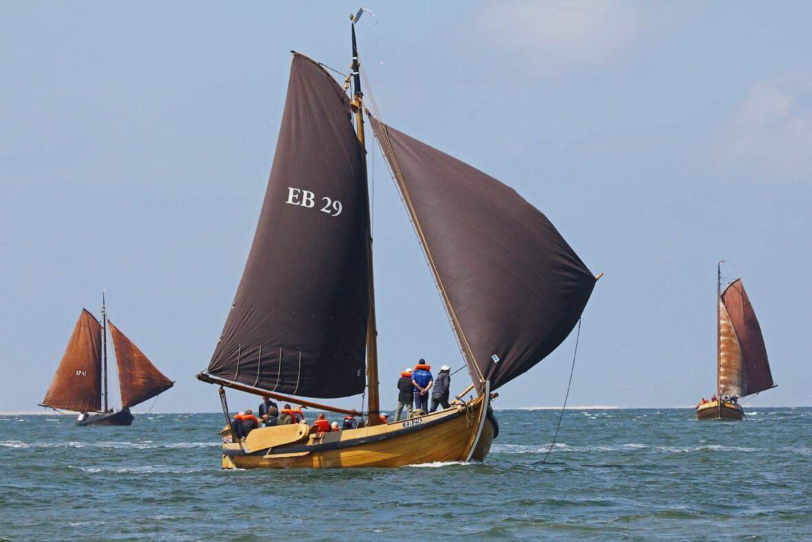

## EB 29

<figure id="foto_eb29">
    
    <figcaption>EB 29</figcaption>
</figure>

### Het verhaal

De EB-29 is op de werf van De Haas in Monnickendam als laatste schip gebouwd voor de familie Van Triest
uit Elburg. De botter werd in 1920 opgeleverd en kostte Fl. 2.500, exclusief de zeilen. Jan van Triest 
(1889-1955) heeft vier jaar gevist met de botter en besloot deze in 1924 te verkopen. Hij was ook nog 
eigenaar van een viswinkel en deze twee dingen samen waren voor hem moeilijk te combineren. De botter 
bracht nog Fl. 1.800,- op.  
De nieuwe eigenaar werd Andries Fleer uit Lemmer de botter werd omgenummerd naar LE-21. In Elburg werd 
verteld dat de botter niet erg snel zeilde, maar Andries had al gauw in de gaten wat er aan mankeerde. 
Nieuwe zwaarden en tuig werden geplaatst en in de eerste de beste wedstrijd tijdens de fameuze Lemmer 
Kermis Week werd de eerste plaats behaald. In de jaren daarna gevolgd door nog vele eerste prijzen.
In 1947 besloot Andries zijn botter te verkopen om in een aakje verder te vissen, want hout blijft hout 
en onderhoud is duur en tijdrovend; daar weten wij intussen alles van.
De nieuwe eigenaar werd de familie Kuipers uit Groningen die bij Westerdijk in Eernewoude de botter liet 
omtoveren tot jacht en tevens het schip omdoopte tot ‘Pieternella’, genoemd naar de oudste dochter van de 
heer Kuiper. Slechts twee jaar heeft de familie van het jacht genoten, voordat ze haar in 1942 weer verkocht 
aan werfbaas Kok in Huizen.  
Kok op zijn beurt deed ook weer het nodige timmerwerk en verkocht in hetzelfde jaar de botter weer door aan de 
familie Hulsman in Bloemendaal.
In 1961 werd Jaap Kramer, een bekend jachtarchitect uit Haarlem, eigenaar. Hij heeft vele opknapbeurten en 
avonturen met het schip beleefd. Een bijzondere ervaring was dat de ‘Pieternella’ aan de basis stond van de 
chartervaart in Nederland. Kramer en zijn opstapper Wim de Bruin (de uitgever van De Spiegel der Zeilvaart) 
hebben in die tijd het water dun gevaren.
In 1970 is ze gezonken en er moest weer veel getimmerd worden. De botter werd bij jachtwerf Opzeeland in Haarlem 
binnen gestald en in afwachting van een zak geld om één en ander te realiseren.  
Rond 1980 bond de Elburger botterstichting de strijd aan om de EB-29 terug te kopen. De onderhandelingen over 
de koop met Jaap Kramer hebben nog wel enige jaren geduurd. Toen de koop in begin 2000 werd gesloten, kreeg de 
stichting er nog een compleet katoenen tuig bij cadeau. Het schip werd opgehaald en vervoerd naar Elburg, waar 
ze tot 2010 onder een dekzijl op de Oude Bleek wat lag weg te maffen.  
Tijdens de jaren dat de botter buiten heeft gestaan, is bijna al het houtwerk totaal uitgedroogd en verrot. 
De enige manier waarop de EB 29 weer in volle glorie de golven zou proeven, zou een volledige restauratie zijn. 
Begin 2011 is daar mee begonnen. Besloten is om het schip in vissermanuitvoering, zoals ze 91 jaar geleden was 
gebouwd, terug te brengen.  
Een werkgroep werd in het leven geroepen onder voorzitterschap van oud-wethouder Gerard van de Velde, om de 
restauratie tot stand te brengen middels het Leer- werkproject.
Het doel van het Leer- werkproject is meerledig: ten eerste de overdracht van kennis en kunde van het oude 
ambacht van scheepsrestaurateur- timmerman. Ten tweede mensen met een afstand tot de arbeidsmarkt weer 
arbeidsritme op te laten doen. En ten derde stagemogelijkheden bieden aan toekomstige scheepstimmerlui.
Tijdens de botterdagen van september 2012 werd de EB 29 weer in volle glorie feestelijk te water gelaten.

    Ik vond de botter ik denk nu 35 jaar geleden in een loods van Op Zeeland in Haarlem,later hoorde ik dat Pils (het ook gehoord had,dus meeuwen op de beug (concurentie) dus.
    Maar zoals jullie gelezen hebben,Pils (Jan Willem Stofberg, red.) kreeg de 17 in handen en wij hadden geen concurrentie. Na veel heen en weer gepraat (dat heeft 20 jaar geduurd) groen licht.
    Met een dieplader door Co van Twillert voorgeschoten (en later keurig door ons terugbetaald) naar Elburg vervoerd en op de ouwe bleek opgeslagen. Het vervolg lezen jullie hierboven.

### Gegevens

| Gegeven                   | Waarde        | Eenheid   |
|---------------------------|---------------|-----------| 
| lengte 	                | 12,85         | mtr       | 	 
| breedte 	                | 4,2           | mtr       | 		        
| diepgang 	                | 0,85          | mtr       | 		 
| kruiphoogte 	            | 2,45	        | mtr       | 	 
| tonnage 	                |    	        | mtr       | 	
| materiaal romp 	        | hout 	        |           |
| materiaal romp (spec.) 	| eikenhout     |           |
| bouwwijze romp 	        | karveel 	    |           |
| seriematige bouw 		    |               |           |
| voortstuwing (oorspr.) 	| zeil          |           | 	 
| masthoogte 	            | 13,75         | mtr       |
| soort tuig 	            | gaffelgetuigd |           |	 
| materiaal zeil 	        | katoen        |           | 	 
| oppervlakte zeil 	        | 70 	        | m2        |
| motortype 	            | Perkins       |           |	 
| motorvermogen             | 36 		    | pk        | 
| motorbouwjaar 		    | 1964          |           |
| bouwjaar vaartuig 	    | 1919 	        |           |
| bouwperiode 	            | 1910-1920 	|           | 

[Federatie Varend Erfgoed Nederland](https://rven.info/schip.aspx?=1810)
