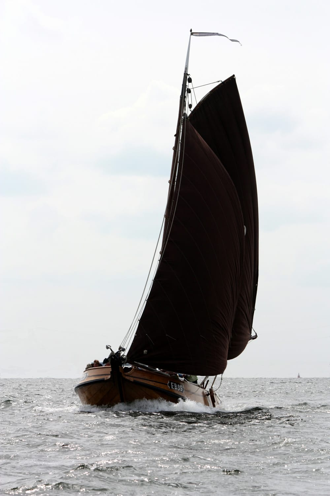

## De EB39

*Geen Botter maar een Bons!*

<figure id="foto_eb39">
    
    <figcaption>EB 39</figcaption>
</figure>

### Het Verhaal van de EB39

De EB 39 is een bons, één van de weinige nog overgebleven schepen van dit type. Dit soort schepen werd in 
Elburg vroeger veel gebruikt voor de visserij. Ze hebben, in tegenstelling tot de botter, geen kromme steven
maar een rechte en zijn qua bouw ook niet echt verwant aan de botter. Ze zijn meer verwant aan de pluut en 
de hoogaars en stammen eigenlijk af van de punter.
De EB 39 werd in 1913 in opdracht van Johannes Broekhuizen, ‘Hannes de Spierik’, gebouwd bij Schepman in Kampen. 
Het schip kostte toen compleet Fl. 1325,-. Hannes viste voornamelijk met haring- en spieringnetten, kubben en kuil. 
Hannes vertrok in 1924 naar Emmen, waar hij een groentehandel begon. Zijn broer Gerardus was toen al postbode 
in die plaats.
De bons werd aanvankelijk nog verhuurd en werd ook wel gebruikt om kool te halen uit Broekerhaven. 
Op 24 januari 1925 wordt de bons voor Fl. 1.000,- verkocht aan Wijnand Westerink Czn. Deze viste op bot, aal, 
spiering, garnalen en haring.
In 1937 krijgt het schip een A-Ford motor, geleverd door M. Zoet en ingebouwd op de werf van Oost te Harderwijk.
In 1957 beëindigt Wijnand Westerink de visserij en verkoopt het schip voor Fl. 1.750,- als pleziervaartuig 
aan K. Vlaanderen uit Huizen. Deze noemt het schip ‘De Jonge Pieter’. In 1979 gaat de bons voor hetzelfde
bedrag over naar J.R. Olie uit Santpoort.
In 1968 wordt het schip voor Fl. 2.000,- aangekocht door het Zuiderzeemuseum te Enkhuizen. Dit museum had al 
eerder de bonzen EB 45 en EB 67 in bezit, maar deze waren gesloopt omdat men onvoldoende middelen had om
de schepen te restaureren.
De EB 39 stond vele jaren naast de hellingschuur bij de Markerhaven van het museum, maar van restaureren
kwam het nooit en ook dit schip dreigde volledig in verval te geraken. Om verder verval te voorkomen 
werd het schip in 1992 overgebracht naar een loods van scheepswerf Stofberg te Enkhuizen. De in 1993 
opgerichte stichting ‘De laatste bons EB 39’ ging in dat jaar een bruikleenovereenkomst aan met het 
Zuiderzeemuseum voor een periode van 10 jaar, stilzwijgend te verlengen met telkens een periode van 5 
jaar. De stichting begon met een intensieve fondsenwerfactie om de restauratie te kunnen bekostigen.
Op zaterdag 6 september 1997 arriveerde de EB 39 inElburg, versterkt met een metalen frame op een 
zandschip van de firma Fernhout uit Zwolle.
Het schip kreeg onderdak in een loods van de firma Papirolux en de restauratie kon beginnen. Deze vond
plaats door personeel van scheepswerf Nieuwboer te Spakenburg, onder voortdurend toezicht van Henk Petersen, 
die zelf ook erg veel werk verzette.
Op 6 september 2001 werd de totaal gerestaureerde bons te water gelaten, een plaatje was het geworden.
De bons is sinds 20 december 2005 toegevoegd aan de vloot van de Stichting tot Behoud van Elburger Botters.

Bron: [Website Botterstichting Elburg](https://botterselburg.nl/pagina_output.php?id=21)

### De Gegevens van de EB39

| Gegeven                   | Waarde        |  
|---------------------------|---------------|   
| lengte 	                | 12     mtr    | 	 
| breedte 	                | 4      mtr    | 
| diepgang 	                | 0,8    mtr    | 		 
| kruiphoogte 	            |    	 mtr    | 	 
| tonnage 	                |    	        | 	
| materiaal romp 	        | hout 	        |  
| materiaal romp (spec.) 	| eikenhout     |  
| bouwwijze romp 	        | karveel 	    |  
| seriematige bouw 		    |               |  
| voortstuwing (oorspr.) 	| zeil          |   	 
| masthoogte 	            | 12,5   mtr    |
| soort tuig 	            | gaffelgetuigd |  	 
| materiaal zeil 	        | katoen        |   	 
| oppervlakte zeil 	        | 70 	 m2     |
| motortype 	            | A-Ford        |  	 
| motorvermogen             | 20 	 pk     | 
| motorbouwjaar 		    | 1936          |  
| bouwjaar vaartuig 	    | 1913 	        |  
| bouwperiode 	            | 1910-1920 	|   

Bron: [Federatie Varend Erfgoed Nederland](https://rven.info/schip.aspx?=1182)

