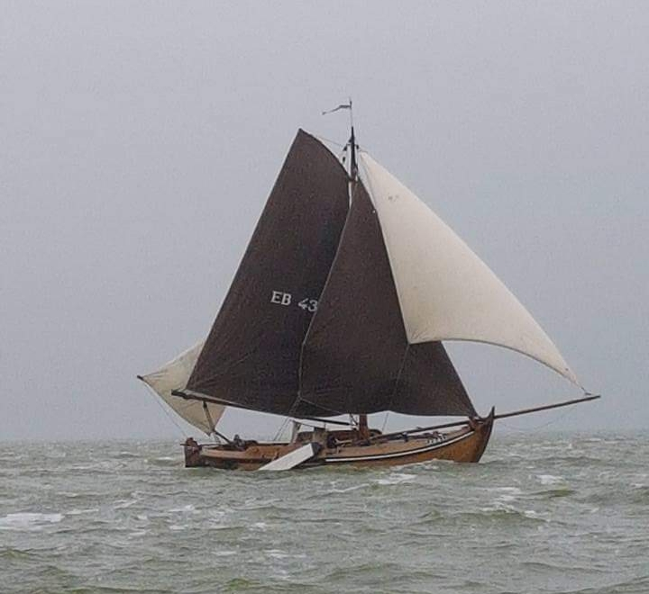

## De EB43

<figure id="foto_eb43">
    
    <figcaption>EB 43</figcaption>
</figure>

### Het Verhaal van de EB43

De EB 43 werd in 1913 in Huizen gebouwd bij de werf van Schaap in opdracht van Kees van der Poel, bijgenaamd de Koeter, voor een bedrag van Fl. 2800,-.
Tot 1922 viste zij onder het nummer HZ 62. In dat jaar kocht Willem van Triest (de Taaie) deze botter voor een bedrag van Fl. 2400,- en kreeg het nummer EB 43. Willem voer als koopschuit voor zijn broer Aart, die vishandelaar was en kocht op zee met name bot en haring van de vissers. Zo nu en dan haalde hij ook een vrachtje kool uit Broekerhaven voor groentehandelaar Hendrik Binnenkamp. Tussentijds werd er ook met de EB 43 gekuild.  
In november 1928 werd de schuit eigendom van Willem’s broer Aart, en Willem werd zetschipper op de EB 43. In december van dat jaar werd de botter van een motor voorzien.
Na de afsluiting van de Zuiderzee verdwenen de haring en de bot en was er geen behoefte meer aan koopschuiten. Voor Fl. 500,- kocht Willem de botter terug van Aart.
In 1934 besloten de broers Willem en Jacob van Triest (EB 23) van botter te ruilen, omdat de botter van Willem groter was, moest Jacob Fl. 1100,- toegeven.  
Omdat de motor nogal eens haperde, besloot Jacob in 1938 door Marinus Zoet een nieuwe motor te laten inbouwen, een 4 cilinder Buick van 20 pk.
In de loop der jaren is de EB 43 een aantal keren onder handen genomen op de werven van Balk (Elburg) en Oost (Harderwijk).
De kuilvisserij vormde het hoofdbestaan, daarnaast werd in span gevist met snoekbaarsdrijfnetten.
Inmiddels was zoon Herman als knecht aan boord gekomen. Nadat Elburg in 1956 werd afgesloten, besloten vader Jacob en zoon Herman de visserij vanuit Harderwijk voort te zetten.
Steeds meer vissers gingen in die jaren over tot de aanschaf van een stalen kotter. In 1960 besloten de Van Triesten deze stap ook te zetten.  
De botter werd in 1961 voor Fl. 6000,- verkocht aan een groepje studenten en kreeg Volendam als thuishaven.
In de jaren zestig werd de heer dr. F.J.Th. Wackers uit Amsterdam eigenaar van de EB 43. De heer Wackers was van 1971 - 1974 voorzitter van de Vereniging Botterbehoud.
Door vertrek naar het buitenland werd vanaf 1976 de heer T. van der Stap als contactpersoon opgenomen in de schepenlijst van de Vereniging Botterbehoud.  
Vanaf 1984 lag de EB 43 op de werf van Balk. Door een slepend meningsverschil tussen de eigenaar en de werfbaas dreigde de EB 43 als verliezer uit de bus te komen. De schuit lag op het droge weg te kwijnen.
Dat ging het bestuur van de Stichting tot Behoud van Elburger Botters te ver en met een gericht plan en een forse financiële bijdrage van Biohorma BV werd de botter aangekocht en vervolgens gerestaureerd op de werf van Nieuwboer in Spakenburg.
Op 3 mei 1991 werd de EB 43 in aanwezigheid van een groot aantal genodigden, waaronder oud-visser Herman van Triest, opnieuw te water gelaten.  
Inmiddels heeft de EB 43 al weer heel wat tochten voor de stichting gemaakt, werd zij in de winter 1997/98 in eigen beheer helemaal opgeknapt en was zij in de zomer van 1998 aanwezig bij ‘Delfsail’!
In de winter van 1999/2000 is de botter in de loods gezet voor onderhoud in eigen beheer. Diverse rotte plekken in het houtwerk worden gerepareerd. In het achterschip komt een nieuw spant aan stuurboordzijde en wordt het hele schip gelakt en geschilderd.
De laatste opknapbeurt van de EB 43 was in 2016/2017.

### De Gegevens van de EB43

| Gegeven                   | Waarde        |  
|---------------------------|---------------|   
| lengte 	                | 13,55  mtr    | 	 
| breedte 	                | 4,1    mtr    | 
| diepgang 	                | 1      mtr    | 		 
| kruiphoogte 	            | 1   	 mtr    | 	 
| tonnage 	                |    	        | 	
| materiaal romp 	        | hout 	        |  
| materiaal romp (spec.) 	| eikenhout     |  
| bouwwijze romp 	        | karveel 	    |  
| seriematige bouw 		    |               |  
| voortstuwing (oorspr.) 	| zeil          |   	 
| masthoogte 	            | 14,5   mtr    |
| soort tuig 	            | gaffelgetuigd |  	 
| materiaal zeil 	        | halfom        |   	 
| oppervlakte zeil 	        | 80 	 m2     |
| motortype 	            | Mitsubishi    |  	 
| motorvermogen             | 45 	 pk     | 
| motorbouwjaar 		    | 1992          |  
| bouwjaar vaartuig 	    | 1913 	        |  
| bouwperiode 	            | 1910-1920 	|   

Bron: [Federatie Varend Erfgoed Nederland](https://rven.info/schip.aspx?=502)

