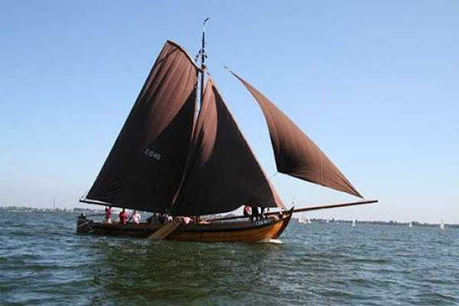

## De EB46 

<figure id="foto_eb46">
    
    <figcaption>EB 46</figcaption>
</figure>

<aside class="note">
    Particulieer bezit
</aside>

### Het Verhaal van de EB46

Van deze botter is weinig op internet te vinden over de historie. Maar wie weet zijn er mensen die aanvullingen kunnen geven.

Bouwjaar is ongeveer 1942
Gevist van 1942 - 1961
Vanaf 1961 als recreatie in gebruik.
Vanaf 1990 weer in Elburg.

### De Gegevens van de EB46

| Gegeven                   | Waarde        |  
|---------------------------|---------------|   
| lengte 	                |        mtr    | 	 
| breedte 	                |        mtr    | 		        
| diepgang 	                |        mtr    | 		 
| kruiphoogte 	            |     	 mtr    | 	 
| tonnage 	                |    	        | 	
| materiaal romp 	        | hout 	        |  
| materiaal romp (spec.) 	| eikenhout     |  
| bouwwijze romp 	        |          	    |  
| seriematige bouw 		    |               |  
| voortstuwing (oorspr.) 	| zeil          |   	 
| masthoogte 	            | 14,5 	 mtr    |
| soort tuig 	            | gaffelgetuigd |  	 
| materiaal zeil 	        |               |   	 
| oppervlakte zeil 	        |   	 m2     |
| motortype 	            |               |  	 
| motorvermogen             |   	 pk     | 
| motorbouwjaar 		    |               |  
| bouwjaar vaartuig 	    | 1892 	        |  
| bouwperiode 	            | 1890-1900 	|   

Bron: [Website Botterbehoud Nederland](https://www.botterbehoud.nl/)

