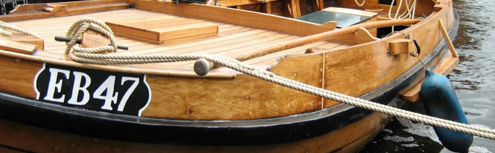

## De EB47

*De jeugdbotter*

<figure id="foto_eb47">
    
    <figcaption>EB 47</figcaption>
</figure>

### Het Verhaal van de EB47

De Botterstichting onderschrijft al jaren het belang om de jeugd bij de botters te betrekken. 
Daarom is ook een speciale opleiding voor de jeugd in het leven geroepen. Veel jongeren hebben inmiddels hun vaardiploma’s behaald en zijn vaak op de werf te vinden.  
Met de eigen jeugdbotter, de EB 47, wordt regelmatig geoefend en mag de jeugd, onder leiding van een ervaren schipper, vaartochten
maken. Het onderhoud en de restauratie van de EB 47 wordt ook door de jongeren uitgevoerd. Hierbij maken ze uiteraard gebruik van 
de deskundigheid van de ervaring van de oudere vrijwilligers.
De Botterstichting hoopt de jeugd zo enthousiast te krijgen dat zij de schippers en scheepstimmermannen van de toekomst worden.
Ook in het museum is aan de jeugd gedacht. Er is in samenwerking met Stichting Edu-Art een speciaal arrangement ontwikkeld
voor kinderen uit groep 7 om ze bekend te maken met het visserijverleden van hun voorouders.

Bron: [Website Botterstichting Elburg](https://botterselburg.nl/pagina/37/de-jeugd-heeft-de-toekomst/)

### De Gegevens van de EB47

| Gegeven                   | Waarde        |  
|---------------------------|---------------|   
| lengte 	                |        mtr    | 	 
| breedte 	                |        mtr    | 
| diepgang 	                |        mtr    | 		 
| kruiphoogte 	            |     	 mtr    | 	 
| tonnage 	                |    	        | 	
| materiaal romp 	        | hout 	        |  
| materiaal romp (spec.) 	| eikenhout     |  
| bouwwijze romp 	        | karveel 	    |  
| seriematige bouw 		    |               |  
| voortstuwing (oorspr.) 	| zeil          |   	 
| masthoogte 	            |        mtr    |
| soort tuig 	            | gaffelgetuigd |  	 
| materiaal zeil 	        |               |   	 
| oppervlakte zeil 	        |  	     m2     |
| motortype 	            |               |  	 
| motorvermogen             |  	     pk     | 
| motorbouwjaar 		    |               |  
| bouwjaar vaartuig 	    | 1933 	        |  
| bouwperiode 	            |  	            |   

Het bottertje is voor de oorlog in de crises jaren gebouwd als tijdverdrijf of hobby, men dacht 1933. Door de blokkemaker van de werf of er mee gevist of gestroopt is.......
De laatste eigenaar had een kroeg in Spakenburg en is na dat die alles verkocht had op een vrachtschip gaan wonen ligplaats Beneden-Leeuwen,ook had hij een oude sleepboot waar hij mee rondtoerde in de zomer.
Zodoende verdaagde hij een keer in Elburg en kwam recht tegenover de werf voor de wal.
Daar zag hij onze jeugd onder aanvoering van Arnoud Witter met allerlei punters en roeibootjes in de weer en dacht dit is iets 
voor mijn kleine bottertje.
Die had hij meegenomen bij zijn vertrek uit Spakenburg.
Hij was begonnen met restaureren maar dat stagneerde, waarna hij contact met ons opnam voor een deal.
Wij op bezoek bij hem aan boord daar troffen wij de botter half onder water aan op zij van zijn schip , pomp der in en drijven. 
Kortom de deal was gauw rond.
Met een vlet van Pieter dacht ik, is het bottertje opgehaald naar Elburg.
Daar is hij door Cees met behulp van vooral de jeugd gerestaureerd

