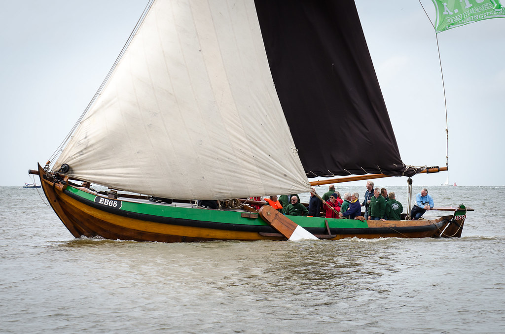

## De EB65

<figure id="foto_eb65">
    
    <figcaption>EB 65</figcaption>
</figure>

<aside class="note">
    Particulier bezit
</aside>

### Het Verhaal van de EB65

*Zeilen is mijn vak, Zeilen is mijn leven, Had ik geld genoeg gehad, dan was ik thuis gebleven. (Deze tekst is te vinden op het deurtje van het vooronder.)*

| Naam | Eigenaar                           | Van        | Tot      | Gebruik       |  
|------|------------------------------------|------------|----------|---------------|  
| BU46 | Hendrik Duijst – Spakenburg        | 1911?      | 1917     | Visserij      |  
| BU46 | Wouter de Jong – Spakenburg        | 1917-06-19 | 1917     | Visserij      |  
| BU46 | Jan Blokhuis – Spakenburg          | 1917-07-03 | 1933?    | Visserij      |  
| BU46 | Havenloods – Amsterdam             | 1948       |          | Visserij      |  
| EB65 | Rien Lipke                         | 1977       |          | Recreatie     |  
| EB65 | Henk Witter/Rien Lipke – Elburg    | 1985?      | 2001     | Recreatie     |  
| EB65 | Ver.Elburg vuvenzestig – Elburg    | 2001       | Heden    | Recreatie     |  

– Van de (laatste) dagen van de botter in dienst als beroepsvisser is het volgende nog bekend.Jan Blokhuis viste met 4 botsleepnetten, 5 haringnetten en boefende de Kuilvisserij. De overige bezittingen waren: 1 breefok, 1 fok, 1 zeil 1 kluifok 1 bazaan 1 bek van de wonderkuil 2 aalkuilen 1 stel kuiltouwen (2 stuks) 1 stel sleeptouwen 1 staaldraad grote kuil 3 klaarzakken 1 botter BU46 incl. spanzeilen; excl. motor.Deze gegevens zijn bekend omdat de heer Blokhuis 16 september 1933 een aanvraag deed voor een tegemoetkoming wegens waarde vermindering van zijn bedrijf.
– De huidige EB65 is de tweede Botter die door de stichting tot behoud van de Elburger Botters is aangekocht. De voormalige ‘Bonzo’ is voor zeshonderd gulden gekocht en naar Elburg verhuisd waar de stichting deze in 1977 aan Rien Lipke verkocht, die hem omdoopte naar EB65. Sinds 1979 ligt de EB65 in zijn thuishaven Elburg. De gemeente Elburg heeft deze Botter inmiddels als varend monument gekenmerkt.
– Rien Lipke heeft samen met zijn vader de Botter op eigen risico geheel gerestaureerd. Van de originele spanten zijn er tenslotte nog 3 overgebleven. Met zelfgemaakte mallen werden nieuwe spanten gemaakt en daarna volgde het aanbrengen van het berghout. Hierna werd een nieuwe huid aangebracht. Ook het vlak werd vervangen.
– In de wintermaanden werden de zwaarden, de blokken, de mast en het roer vervangen. Ook het interieur werd zo orgineel mogelijk nagemaakt.
– In 1979 werd de EB65 opnieuw te water gelaten. De bemanning van de Botter bestond in veel gevallen uit de zogenaamde ‘Botterboys’. Dit was een groep jonge jochies met een vroeg ontwikkelde voorliefde voor Botters en zeilen. Dit waren  Cees Leusink, Pieter de Jong, Arjen de Gunst en René Jansma. Vandaag de dag kunnen deze 4 jongens vertrouwen op een grote achterban met mensen die graag willen helpen om de botter in de vaar te houden!
– De naam ‘Botterboys’ is inmiddels een begrip in Elburg en daarbuiten. Al vroeg waren deze jongens met de Punter EB66 op het water te vinden, zoekend naar paling. Door Rien Lipke werden ze ingezet bij het opknappen en onderhouden van de EB65. Toen Rien Lipke en Henk Witter aan wedstrijden gingen deelnemen mochten de jongens vaak mee als bemanning.
– De Botterboys hebben zich inmiddels verenigd in een stichting die nu de eigenaar is van de Botter EB65.
– In de wintermaanden zijn ze elke week druk met de botter weer in goede staat te brengen voor het vaarseizoen. Het timmer- schilderwerk en het technische gedeelte doen ze allemaal zelf. De EB65 is met zijn bemanning ook regelmatig te zien bij zeilwedstrijden en andere evenementen zoals b.v. Visserijdagen en de botterdagen te Elburg.

Bron: [Website EB65](http://www.eb65.nl/geschiedenis/van-de-eb65/)

### De Gegevens van de EB65

| Gegeven                   | Waarde        |  
|---------------------------|---------------|   
| lengte 	                |  13,65 mtr    | 	 
| breedte 	                |   4,05 mtr    | 
| diepgang 	                |   0,95 mtr    | 		 
| kruiphoogte 	            |   1,35 mtr    | 	 
| tonnage 	                |    	        | 	
| materiaal romp 	        | hout 	*)      |  
| materiaal romp (spec.) 	| eikenhout *)  |  
| bouwwijze romp 	        | karveel *)    |  
| seriematige bouw 		    |               |  
| voortstuwing (oorspr.) 	| zeil          |   	 
| masthoogte 	            |        mtr    |
| soort tuig 	            | gaffelgetuigd |  	 
| materiaal zeil 	        |               |   	 
| oppervlakte zeil 	        |  	     m2     |
| motortype 	            |               |  	 
| motorvermogen             |  	     pk     | 
| motorbouwjaar 		    |               |  
| bouwjaar vaartuig 	    | 1908 	        |  
| bouwperiode 	            | 1900-1910	    |

Bron: [Federatie Varend Erfgoed Nederland](https://rven.info/schip.aspx?=3591)

<aside class="note">
    *) Op de site van RVEN staat dat materiaal 'ijzer' is en de boouwwijze van de romp 'geklonken' dit klopt nier (red)
</aside>

