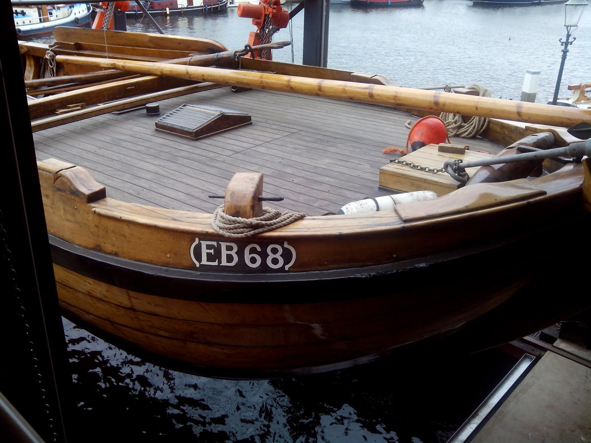

## De EB68

<figure id="foto_eb68">
    
    <figcaption>EB 68</figcaption>
</figure>

### Het Verhaal van de EB68

Jakobus Broekhuizen, 1899-1935, (Hannes de Spierik), zoon van Dirk Broekhuizen (EB 52) en Gerritje Saris, koopt op 1 maart 1915 de botter BU 152 van Wouter Heek in Bunschoten.
De botter kreeg het vergunningnummer EB 68. Het geld voor de aankoop leende hij van zijn oudste zuster Hendrika van de Wetering-Broekhuizen.
Hij viste met botnetten, spieringnetten, haringnetten, kubben en kuil tussen Harderwijk en Schokland. In september 1928 stopte hij met vissen en ging werken bij de tarweverwerkende fabriek Chios in Zaandam.
Vanaf eind 1928 huurt zijn zwager, Jan van Triest, de botter van Kobus. In mei 1930 koopt Jan de EB 68 voor Fl. 300,-. De botter wordt in 1935 gesloopt.
In 1935 koopt Jan van Triest de HK 129, maar deze wordt in 1936 alweer verkocht. Jan van Triest vist samen met zijn zoon Aart. In 1936 koopt Jan van Wouter Mons uit Enkhuizen de EH 94, die eerder eigendom was van Jan Oldenhof uit Vollenhove en daar viste onder het nummer VN 6.
Deze botter, nu ook weer met het nummer EB 68, had als bijzonderheid dat de waterbalk voor de mast zat. Dat kwam maar bij enkele botters voor. Op het deurtje van het vooronder waren twee krabben geschilderd met de tekst ‘de dingen lopen wonderlijk’.
De botter had een A-Ford motor, die later werd vervangen door een 6 cylinder Dodge motor.
In april 1951 werd de visvergunning van de EB 68 overgeschreven op naam van de zoon Aart van Triest. Na de dood van Jan in 1955 wordt Aart eigenaar. Vanaf 1956 vist Aart op het IJsselmeer.
In 1961 laat Aart een kotter bouwen bij Boomsma in Sneek, met deze kotter vist hij tot 1971 ook onder het nummer EB 68. Daarna werd de kotter verkocht als pleziervaartuig.
Aart schafte een ijzeren schouw aan voor de visserij op de Randmeren. Aarts zoon Jan is nu houder van de vergunning EB 68.
De oude botter werd in 1961 verkocht aan J. de Vin uit Slagharen. Vanaf 1978 was J. Nieuwenhout uit Leeuwarden, stiefzoon van de Vin, de eigenaar. In die tijd kreeg de botter, vanwege de vele kosten, de naam ‘Duitendief’.
In 1981 werd de EB 68 verkocht aan IJsbrand Dijkstra uit Buitenhoogte, vervolgens werd C. van Twillert uit Elburg de eigenaar en deze heeft de botter in bruikleen gegeven aan de Stichting tot Behoud van Elburger Botters.

Bron: [Website Botterstichting Elburg](https://botterselburg.nl/pagina_output.php?id=21)

### De Gegevens van de EB68

| Gegeven                   | Waarde        |  
|---------------------------|---------------|   
| lengte 	                | 13,2   mtr    | 	 
| breedte 	                | 4,5    mtr    | 		        
| diepgang 	                | 0,85   mtr    | 		 
| kruiphoogte 	            |     	 mtr    | 	 
| tonnage 	                |    	        | 	
| materiaal romp 	        | hout 	        |  
| materiaal romp (spec.) 	| eikenhout     |  
| bouwwijze romp 	        |          	    |  
| seriematige bouw 		    |               |  
| voortstuwing (oorspr.) 	| zeil          |   	 
| masthoogte 	            | 14,5 	 mtr    |
| soort tuig 	            | gaffelgetuigd |  	 
| materiaal zeil 	        | halfom        |   	 
| oppervlakte zeil 	        | 70 	 m2     |
| motortype 	            | Mitsubishi    |  	 
| motorvermogen             | 50 	 pk     | 
| motorbouwjaar 		    | 1992          |  
| bouwjaar vaartuig 	    | 1998 	        |  
| bouwperiode 	            | 1890-1900 	|   

Bron: [Federatie Varend Erfgoed Nederland](https://rven.info/schip.aspx?=92)

